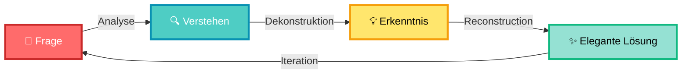

<div align="center">

<!-- Animated Header with Gradient -->


<!-- Typing SVG -->
<a href="https://git.io/typing-svg"></a>

<!-- Badges Explosion -->
<p>


</p>

<p>


</p>

<!-- Wave Divider -->


</div>

<!-- ASCII Art Banner -->
```ascii
    ╔═══════════════════════════════════════════════════════════════╗
    ║                                                               ║
    ║      ██████╗ ██╗   ██╗███████╗██████╗ ██╗   ██╗██╗          ║
    ║     ██╔═══██╗██║   ██║██╔════╝██╔══██╗██║   ██║██║          ║
    ║     ██║   ██║██║   ██║█████╗  ██████╔╝██║   ██║██║          ║
    ║     ██║▄▄ ██║██║   ██║██╔══╝  ██╔══██╗██║   ██║██║          ║
    ║     ╚██████╔╝╚██████╔╝███████╗██║  ██║╚██████╔╝███████╗     ║
    ║      ╚══▀▀═╝  ╚═════╝ ╚══════╝╚═╝  ╚═╝ ╚═════╝ ╚══════╝     ║
    ║                                                               ║
    ║   ┌─────────────────────────────────────────────────────┐   ║
    ║   │  "Ein Schelm bleibt selten schlicht,               │   ║
    ║   │   er biegt sich die Welt ins Licht."               │   ║
    ║   └─────────────────────────────────────────────────────┘   ║
    ╚═══════════════════════════════════════════════════════════════╝
```

<div align="center">

## 🌈 **Die Legende des Querulanten** 🌈

</div>

---

<details open>
<summary><b>📖 Kapitel I: Das Erwachen der Frage</b></summary>

<br>

<div align="center">

```diff
! Es war einmal in einer Welt aus Nullen und Einsen...
```

</div>

In den dunklen Korridoren des Konventionellen, wo Code still und gehorsam seinen vorgegebenen Pfaden folgte, wurde ein Kind geboren. Nicht aus Fleisch und Blut, sondern aus **Neugier** und **konstruktivem Widerspruch**. Man nannte es: **Querulantenkind**.

> *„Warum?"* - war sein erstes Wort.  
> *„Warum nicht anders?"* - sein zweites.  
> *„Was wäre, wenn...?"* - sein drittes.

Die anderen Entwickler schüttelten ihre Köpfe. „Der Code funktioniert doch", sagten sie. „Warum etwas ändern, das nicht kaputt ist?"

Doch das Querulantenkind sah tiefer. Es sah nicht nur *funktionierende* Systeme, sondern die **Schatten ungenutzten Potenzials**. Wo andere `if-else` Ketten akzeptierten, fragte es nach Pattern Matching. Wo andere verschachtelte Callbacks hinnahmen, träumte es von eleganten Promises.

<table align="center">
<tr>
<td width="50%">

### 🔴 Vorher
```javascript
// Die alte Welt
function processData(data, callback) {
  validateData(data, function(err, valid) {
    if (err) return callback(err);
    transformData(valid, function(err, transformed) {
      if (err) return callback(err);
      saveData(transformed, function(err, result) {
        if (err) return callback(err);
        callback(null, result);
      });
    });
  });
}
```

</td>
<td width="50%">

### 🟢 Nachher
```javascript
// Die neue Welt
async function processData(data) {
  const valid = await validateData(data);
  const transformed = await transformData(valid);
  return await saveData(transformed);
}

// Oder noch eleganter:
const processData = pipe(
  validateData,
  transformData,
  saveData
);
```

</td>
</tr>
</table>

<div align="center">

**„Siehst du?"**, flüsterte das Querulantenkind. **„Die Welt lässt sich biegen."**

</div>

</details>

---

<details open>
<summary><b>⚡ Kapitel II: Der Tanz mit der Komplexität</b></summary>

<br>

Die Jahre vergingen, und das Querulantenkind wuchs. Nicht größer, sondern **tiefer**. Es tauchte ein in die Mysterien der Algorithmen, die Philosophie der Patterns, die Poesie der Clean Architecture.

<div align="center">



</div>

Eines Tages begegnete das Querulantenkind einem **monolithischen Legacy-System** - ein Koloss aus 100.000 Zeilen ungetestetem Code, gewachsen über Jahrzehnte, gefürchtet von allen.

> **Der Koloss:** „Wage es nicht, mich zu verändern! Ich bin gewachsen, ich bin bewährt, ich bin... komplex!"
>
> **Das Querulantenkind:** „Komplex? Oder nur kompliziert? Lass uns das herausfinden."

Und so begann der Tanz. Zeile für Zeile, Funktion für Funktion, fragte das Querulantenkind:

1. **„Was ist der eigentliche Zweck?"** 🎯
2. **„Welche Annahmen sind hier versteckt?"** 🔎
3. **„Was passiert, wenn ich das umdrehe?"** 🔄
4. **„Gibt es einen eleganteren Weg?"** ✨

<br>

<div align="center">

| Prinzip | Alt | Neu |
|:---:|:---:|:---:|
| 📦 **Modularität** | Ein 5000-Zeilen-File | 50 kohäsive Module à 100 Zeilen |
| 🧪 **Testbarkeit** | 0% Coverage | 95% Coverage mit sinnvollen Tests |
| 🎨 **Abstraktion** | Konkrete Implementierungen überall | Interfaces & Dependency Injection |
| 🔄 **Wiederverwendung** | Copy-Paste-Code | DRY Principles & Composition |
| 📚 **Verständlichkeit** | Niemand wagt es zu ändern | Self-documenting Code |

</div>

Der Koloss begann zu zittern. Nicht aus Angst vor Zerstörung, sondern vor **Transformation**. Und als die Sonne aufging, stand dort kein Monster mehr, sondern ein **elegantes, modulares System** - immer noch mächtig, aber nun auch **schön**.

</details>

---

<details open>
<summary><b>🌟 Kapitel III: Die Philosophie des Lichts</b></summary>

<br>

Doch das Querulantenkind wusste: **Technik allein ist nicht genug.**

<div align="center">

```
    ╭─────────────────────────────────────────────╮
    │                                             │
    │   "Code ist nicht nur für Maschinen.       │
    │    Code ist Kommunikation.                  │
    │    Code ist Kunst.                          │
    │    Code ist Verantwortung."                 │
    │                                             │
    │         - Das Querulantenkind               │
    │                                             │
    ╰─────────────────────────────────────────────╯
```

</div>

Es lernte die **sieben Säulen des eleganten Widerstands**:

<table>
<tr>
<td align="center" width="14.28%">
<br>
<sub><b>Frage alles,<br>akzeptiere nichts<br>blind</b></sub>
</td>
<td align="center" width="14.28%">
<br>
<sub><b>Verstehe den<br>Kontext und<br>die Menschen</b></sub>
</td>
<td align="center" width="14.28%">
<br>
<sub><b>Perfekt ist<br>der Feind<br>von gut</b></sub>
</td>
<td align="center" width="14.28%">
<br>
<sub><b>Es gibt immer<br>einen dritten<br>Weg</b></sub>
</td>
<td align="center" width="14.28%">
<br>
<sub><b>Auch du<br>kannst irren</b></sub>
</td>
<td align="center" width="14.28%">
<br>
<sub><b>Hinterfrage<br>auch die<br>Autoritäten</b></sub>
</td>
<td align="center" width="14.28%">
<br>
<sub><b>Liebe was<br>du tust</b></sub>
</td>
</tr>
</table>

<br>

Und so zog das Querulantenkind durch die Repositories der Welt, ein **digitaler Wanderer** zwischen den Commits. Manche nannten es einen Störenfried, andere einen Visionär. Doch das Querulantenkind lächelte nur und sagte:

<div align="center">

### 💎 **„Ich bin weder das eine noch das andere."**

### **„Ich bin einfach jemand, der fragt:"**


</div>

</details>

---

<details open>
<summary><b>🎭 Epilog: Das Erbe des Schelms</b></summary>

<br>

Und so endet unsere Geschichte nicht, denn **das Querulantenkind ist unsterblich**. Es lebt in jedem, der:

- 🔍 **Fragt**, statt blind zu folgen
- 🛠️ **Optimiert**, wo andere sich zufrieden geben
- 💡 **Innoviert**, wo Tradition herrscht
- 🌈 **Die Welt ins Licht biegt**, eine Zeile Code nach der anderen

<div align="center">

```ascii
         .            *          .       .              .
    .        .   ✨  Ein Schelm bleibt selten schlicht  ✨       *
        *          er biegt sich die Welt ins Licht          .
    .      .                *            .         .             .
         *        .               .            *        .    *
```

---

### 🌠 **Möge dein Code rebellisch und deine Fragen unbequem sein.**

---

[](https://github.com/querulantenkind)
[](https://github.com/querulantenkind)

</div>

</details>

---

<div align="center">

## 🧰 **Das Arsenal des Querulanten**

### Sprachen & Werkzeuge

<p>

</p>

<p>

</p>

<p>

</p>

<p>

</p>

---

## 📊 **GitHub Statistiken**


---

## 🏆 **Trophy Case**


---

## 🎯 **Coding Philosophie**

</div>

```python
class Querulant:
    def __init__(self):
        self.questions = float('inf')
        self.comfort_zone = None
        self.status_quo = "challenged"
    
    def approach_problem(self, problem):
        """
        Ein Schelm bleibt selten schlicht,
        er biegt sich die Welt ins Licht.
        """
        while not self.is_elegant(problem.solution):
            self.ask_why()
            self.challenge_assumptions()
            self.explore_alternatives()
            problem.solution = self.refactor(problem.solution)
        
        return problem.solution
    
    def is_elegant(self, solution):
        return (
            solution.is_simple() and
            solution.is_readable() and
            solution.is_maintainable() and
            solution.sparks_joy()
        )
    
    def philosophy(self):
        return {
            "motto": "Question everything, optimize passionately",
            "belief": "The best solutions emerge from uncomfortable questions",
            "mission": "Bend the world into the light, one commit at a time"
        }
```

<div align="center">

---

## 🌐 **Vernetze dich mit dem Querulanten**

<p>
<a href="https://github.com/querulantenkind"></a>
<a href="https://twitter.com/querulantenkind"></a>
<a href="https://linkedin.com/in/querulantenkind"></a>
<a href="https://dev.to/querulantenkind"></a>
<a href="mailto:querulant@example.com"></a>
</p>

---

## 💭 **Letzte Worte**

> *„In einer Welt voller Copy-Paste,*  
> *sei jemand der fragt: 'Was wäre, wenn...?'*  
> *In einer Welt voller Best Practices,*  
> *sei jemand der sucht: 'Was ist BETTER Practice?'*  
> *Denn ein Schelm bleibt selten schlicht -*  
> *er biegt sich die Welt ins Licht."*
>
> **- Querulantenkind, 2025**

---

### 📈 **Besucherzähler**


---


### ⭐ **Wenn dir gefällt, was du siehst, lass einen Stern da!**

</div>

---

<div align="center">
<sub>Erstellt mit 💖, 🤔 und einer gesunden Portion konstruktivem Chaos</sub><br>
<sub>© 2025 Querulantenkind | MIT License | Ein Projekt der eleganten Störung</sub>
</div>
