<div align="center">

<!-- 
╔════════════════════════════════════════════════════════════════╗
║  HEADER SECTION                                                ║
║  → Animierter Header mit Gradient                             ║
║  → Automatisch generiert via capsule-render.vercel.app       ║
╚════════════════════════════════════════════════════════════════╝
-->


<!-- 
╔════════════════════════════════════════════════════════════════╗
║  ANIMATED TYPING EFFECT                                        ║
║  → Zeigt verschiedene Texte in Loop                           ║
║  → Service: readme-typing-svg.demolab.com                     ║
║  → Anpassbar via URL Parameter                                ║
╚════════════════════════════════════════════════════════════════╝
-->

<a href="https://git.io/typing-svg">
  
</a>

---

### 💫 **"Wenn wir die Ziele wollen, wollen wir auch die Mittel."** 💫
### *— Friedrich Nietzsche*

---

<!-- 
╔════════════════════════════════════════════════════════════════╗
║  STATUS BADGES                                                 ║
║  → Statische Badges (shields.io)                              ║
║  → for-the-badge Style = groß & auffällig                     ║
║  → Farben manuell gewählt für Maximum Impact                  ║
╚════════════════════════════════════════════════════════════════╝
-->

<p align="center">
  
  
  
</p>

<!-- 
╔════════════════════════════════════════════════════════════════╗
║  SYSTEM BADGES - DEIN SETUP                                   ║
║  → Zeigt dein Arch Linux Setup                                ║
║  → Logos automatisch via shields.io simple-icons              ║
╚════════════════════════════════════════════════════════════════╝
-->

<p align="center">
  
  
  
  
  
</p>

<!-- 
╔════════════════════════════════════════════════════════════════╗
║  PROFILE METRICS - AUTOMATISCH                                ║
║  → Profile Views: komarev.com API                             ║
║  → Followers/Stars: shields.io GitHub API                     ║
║  → Updates automatisch bei jedem Seitenaufruf                 ║
╚════════════════════════════════════════════════════════════════╝
-->

<p align="center">
  
  
  
</p>

<!-- 
╔════════════════════════════════════════════════════════════════╗
║  SOCIAL LINKS                                                  ║
║  → Anpassen: URLs durch deine eigenen ersetzen               ║
║  → Nicht genutzte Links einfach löschen                       ║
╚════════════════════════════════════════════════════════════════╝
-->

<p align="center">
  <a href="mailto:github@pixelpathetisch.org">
    
  </a>
  <a href="https://github.com/Querulantenkind">
    
  </a>
  <!-- Weitere Social Links hier einfügen:
  <a href="https://linkedin.com/in/DEIN-PROFIL">
    
  </a>
  <a href="https://twitter.com/DEIN-HANDLE">
    
  </a>
  -->
</p>

<!-- 
╔════════════════════════════════════════════════════════════════╗
║  ASCII ART DIVIDER                                            ║
║  → Manuell erstellt für Extra Visual Impact                   ║
║  → Optional: Kann durch einfaches --- ersetzt werden          ║
╚════════════════════════════════════════════════════════════════╝
-->

```
╔═══════════════════════════════════════════════════════════════════════╗
║                                                                       ║
║     ██╗    ██╗███████╗██╗      ██████╗ ██████╗ ███╗   ███╗███████╗  ║
║     ██║    ██║██╔════╝██║     ██╔════╝██╔═══██╗████╗ ████║██╔════╝  ║
║     ██║ █╗ ██║█████╗  ██║     ██║     ██║   ██║██╔████╔██║█████╗    ║
║     ██║███╗██║██╔══╝  ██║     ██║     ██║   ██║██║╚██╔╝██║██╔══╝    ║
║     ╚███╔███╔╝███████╗███████╗╚██████╗╚██████╔╝██║ ╚═╝ ██║███████╗  ║
║      ╚══╝╚══╝ ╚══════╝╚══════╝ ╚═════╝ ╚═════╝ ╚═╝     ╚═╝╚══════╝  ║
║                                                                       ║
║          🐧 Powered by Arch Linux | Built with ❤️ in Hamburg         ║
║                                                                       ║
╚═══════════════════════════════════════════════════════════════════════╝
```

</div>

---

<div align="center">

## 📊 **GITHUB STATISTIKEN** 📊

> **🤖 Automatisch aktualisiert** bei jedem Seitenaufruf durch externe APIs

</div>

<!-- 
╔════════════════════════════════════════════════════════════════╗
║  GITHUB STATS CARDS                                            ║
║  Service: github-readme-stats.vercel.app                       ║
║  → Keine GitHub Actions nötig                                 ║
║  → Updates bei jedem Page Load                                ║
║  → Theme: 'radical' mit Custom Colors                         ║
║                                                                ║
║  Anpassungen möglich:                                         ║
║  • &theme=radical (andere: tokyonight, dracula, gruvbox)     ║
║  • &show_icons=true (Icons anzeigen)                         ║
║  • &count_private=true (Private Repos zählen)                ║
║  • &include_all_commits=true (Alle Commits, nicht nur 2024)  ║
║  • &hide=issues,contribs (Bestimmte Stats verstecken)        ║
╚════════════════════════════════════════════════════════════════╝
-->

<table align="center">
<tr>
<td width="50%" align="center">

<!-- GitHub Stats Card -->


</td>
<td width="50%" align="center">

<!-- GitHub Streak Stats -->


</td>
</tr>
</table>

<table align="center">
<tr>
<td width="50%" align="center">

<!-- Top Languages Card -->


</td>
<td width="50%" align="center">

<!-- GitHub Trophies -->


</td>
</tr>
</table>

<!-- 
╔════════════════════════════════════════════════════════════════╗
║  ACTIVITY GRAPH                                                ║
║  Service: github-readme-activity-graph.vercel.app              ║
║  → Zeigt Contribution Activity über Zeit                      ║
║  → Custom Colors für dein Theme                               ║
╚════════════════════════════════════════════════════════════════╝
-->

<div align="center">

### 📈 **Contribution Activity**


</div>

<!-- 
╔════════════════════════════════════════════════════════════════╗
║  CONTRIBUTION SNAKE ANIMATION                                  ║
║  → OPTIONAL: Braucht GitHub Action (siehe Setup unten)        ║
║  → Falls nicht gewünscht: Einfach auskommentieren/löschen    ║
║  → Sehr cool, aber nicht essentiell                           ║
╚════════════════════════════════════════════════════════════════╝

<div align="center">

### 🐍 **Contribution Snake**

<picture>
  <source media="(prefers-color-scheme: dark)" srcset="https://raw.githubusercontent.com/Querulantenkind/Querulantenkind/output/github-snake-dark.svg">
  <source media="(prefers-color-scheme: light)" srcset="https://raw.githubusercontent.com/Querulantenkind/Querulantenkind/output/github-snake.svg">
  
</picture>

</div>
-->

---

<div align="center">

## 🎯 **ÜBER MICH** 🎯

</div>

<!-- 
╔════════════════════════════════════════════════════════════════╗
║  PROFILE BOX - MANUELL                                        ║
║  → Hier deine persönlichen Infos eintragen                    ║
║  → ASCII Box für visuellen Impact                             ║
╚════════════════════════════════════════════════════════════════╝
-->

```yaml
╔══════════════════════════════════════════════════════════════════╗
║                        👤 PERSÖNLICHES                           ║
╠══════════════════════════════════════════════════════════════════╣
║                                                                  ║
║  Name:           Luca                                           ║
║  Location:       Hamburg, Deutschland 🇩🇪                       ║
║  Role:           Student & Aspiring SysAdmin                    ║
║  Age:            [DEIN ALTER]                                   ║
║  Languages:      Deutsch (native), English (fluent)             ║
║                                                                  ║
╠══════════════════════════════════════════════════════════════════╣
║                        💻 TECH STACK                             ║
╠══════════════════════════════════════════════════════════════════╣
║                                                                  ║
║  OS:             Arch Linux (Kernel 6.16.8-arch3-1)            ║
║  Desktop:        KDE Plasma 6.4.5 on Wayland                   ║
║  Terminal:       [DEIN TERMINAL - z.B. Konsole, Alacritty]     ║
║  Shell:          [DEINE SHELL - z.B. Bash, Zsh, Fish]          ║
║  Editor:         [DEIN EDITOR - z.B. Neovim, VS Code]          ║
║  IDE:            [DEINE IDE - z.B. PyCharm, VS Code]           ║
║                                                                  ║
║  Hardware:                                                      ║
║  ├─ CPU:         AMD Ryzen 5 1600 (12 Threads)                 ║
║  ├─ RAM:         34 GB DDR4 (33.6 GB usable)                   ║
║  ├─ GPU:         NVIDIA GeForce GTX 1060 6GB                   ║
║  └─ Board:       Gigabyte Technology Co., Ltd.                 ║
║                                                                  ║
╠══════════════════════════════════════════════════════════════════╣
║                        🎯 CURRENT FOCUS                          ║
╠══════════════════════════════════════════════════════════════════╣
║                                                                  ║
║  • Linux System Administration & Scripting                      ║
║  • Python Programming & Automation                              ║
║  • Docker & Containerization                                    ║
║  • Git & Version Control Workflows                              ║
║  • DevOps Practices & CI/CD                                     ║
║                                                                  ║
╠══════════════════════════════════════════════════════════════════╣
║                        📅 JOURNEY                                ║
╠══════════════════════════════════════════════════════════════════╣
║                                                                  ║
║  Started:        August 2024                                    ║
║  Motivation:     Hunger nach neuem Wissen & praktischer         ║
║                  Erfahrung in der IT-Welt                       ║
║                                                                  ║
║  Philosophy:     "Wenn wir die Ziele wollen,                    ║
║                   wollen wir auch die Mittel."                  ║
║                                                                  ║
╠══════════════════════════════════════════════════════════════════╣
║                        📧 CONTACT                                ║
╠══════════════════════════════════════════════════════════════════╣
║                                                                  ║
║  Email:          github@pixelpathetisch.org                     ║
║  GitHub:         github.com/Querulantenkind                     ║
║  Website:        [DEINE WEBSITE falls vorhanden]                ║
║                                                                  ║
╚══════════════════════════════════════════════════════════════════╝
```

<!-- 
╔════════════════════════════════════════════════════════════════╗
║  CURRENT LEARNING - MANUELL                                   ║
║  → Aktualisiere diese Section regelmäßig                      ║
║  → Zeigt woran du gerade arbeitest                            ║
╚════════════════════════════════════════════════════════════════╝
-->

<div align="center">

### 📚 **Aktuell lerne ich**

</div>

<table align="center" width="90%">
<tr>
<td width="33%" align="center">

**🐍 Python**

```python
Learning Path:
├─ Grundlagen ✅
├─ Functions ✅
├─ OOP 🔄
├─ Data Structures 🔄
└─ Advanced Topics ⏳
```

**Progress:** `████████░░ 80%`

</td>
<td width="33%" align="center">

**🐙 Git & GitHub**

```bash
Skills:
├─ Basic Commands ✅
├─ Branching ✅
├─ Merging 🔄
├─ Collaboration 🔄
└─ Advanced Git ⏳
```

**Progress:** `████████░░ 80%`

</td>
<td width="33%" align="center">

**🐧 Linux Admin**

```bash
Topics:
├─ File Management ✅
├─ Permissions ✅
├─ Bash Scripting 🔄
├─ Services 🔄
└─ Networking ⏳
```

**Progress:** `███████░░░ 70%`

</td>
</tr>
</table>

<div align="center">

**Legend:** `✅ Completed` • `🔄 In Progress` • `⏳ Planned`

</div>

---

<div align="center">

## 🛠️ **TECHNOLOGIE-STACK** 🛠️

### 💻 **Sprachen, Tools & Frameworks**

</div>

<!-- 
╔════════════════════════════════════════════════════════════════╗
║  TECH STACK BADGES                                            ║
║  → Badges von shields.io                                      ║
║  → for-the-badge Style für maximalen Impact                   ║
║  → Logos automatisch via simple-icons                         ║
║                                                                ║
║  Anpassung:                                                   ║
║  • Nicht genutzte Badges löschen                              ║
║  • Neue hinzufügen: shields.io/badges für Generator          ║
║  • Reihenfolge nach Erfahrungslevel sortieren                ║
╚════════════════════════════════════════════════════════════════╝
-->

### 🐧 **Operating Systems & Virtualization**

<p align="center">
  
  
  
  
  
  
  
</p>

### 💻 **Programming Languages**

<p align="center">
  
  
  
  
  
  
  
  
</p>

### 🔧 **DevOps & Tools**

<p align="center">
  
  
  
  
  
  
  
  
</p>

### 🗄️ **Databases & Cloud**

<p align="center">
  
  
  
  
  
  
  
</p>

### 📝 **Editors & IDEs**

<p align="center">
  
  
  
  
  
</p>

---

<div align="center">

## 🎓 **SKILL LEVELS** 🎓

> **📊 Selbsteinschätzung** - Regelmäßig aktualisiert

</div>

<!-- 
╔════════════════════════════════════════════════════════════════╗
║  SKILL MATRIX - MANUELL                                       ║
║  → Aktualisiere diese Section alle paar Wochen               ║
║  → ASCII Progress Bars für visuellen Impact                   ║
║  → Ehrliche Einschätzung ist wichtiger als hohe Zahlen       ║
╚════════════════════════════════════════════════════════════════╝
-->

<table align="center" width="100%">
<tr>
<td width="50%">

### 🐧 **Linux & System Administration**

```text
Linux Grundlagen      ████████████████████ 100%
Bash Scripting        ██████████████████░░  90%
Package Management    ██████████████████░░  90%
User Management       ████████████████░░░░  80%
File Systems          ███████████████░░░░░  75%
Networking            ███████████████░░░░░  75%
Security (Firewall)   █████████████░░░░░░░  65%
Service Management    ██████████████░░░░░░  70%
Performance Tuning    ████████████░░░░░░░░  60%
Advanced Clustering   ████████░░░░░░░░░░░░  40%
```

</td>
<td width="50%">

### 💻 **Programming & Development**

```text
Python Basics         ████████████████████ 100%
Git & Version Control ██████████████████░░  90%
OOP Concepts          ████████████████░░░░  80%
Data Structures       ███████████████░░░░░  75%
Algorithms            ██████████████░░░░░░  70%
Web Development       █████████████░░░░░░░  65%
APIs & REST           ████████████░░░░░░░░  60%
Testing & TDD         ███████████░░░░░░░░░  55%
Design Patterns       ██████████░░░░░░░░░░  50%
Microservices         ████████░░░░░░░░░░░░  40%
```

</td>
</tr>
<tr>
<td width="50%">

### 🔧 **DevOps & Automation**

```text
Docker Basics         ████████████████████ 100%
Git Workflows         ██████████████████░░  90%
CI/CD Concepts        █████████████████░░░  85%
Infrastructure Code   ███████████████░░░░░  75%
Docker Compose        ████████████████░░░░  80%
Container Orchestr.   ███████████░░░░░░░░░  55%
Ansible               ██████████░░░░░░░░░░  50%
Monitoring & Logs     ████████████░░░░░░░░  60%
Kubernetes            █████████░░░░░░░░░░░  45%
Cloud Platforms       ███████░░░░░░░░░░░░░  35%
```

</td>
<td width="50%">

### 🗄️ **Databases & Networking**

```text
SQL Grundlagen        ████████████████████ 100%
MySQL/PostgreSQL      █████████████████░░░  85%
TCP/IP Basics         ████████████████░░░░  80%
DNS & DHCP            ███████████████░░░░░  75%
Firewalls (iptables)  ███████████████░░░░░  75%
NoSQL Databases       █████████████░░░░░░░  65%
Database Optimization ████████████░░░░░░░░  60%
VPN & Tunneling       ███████████░░░░░░░░░  55%
Load Balancing        ██████████░░░░░░░░░░  50%
Advanced Networking   █████████░░░░░░░░░░░  45%
```

</td>
</tr>
</table>

---

<div align="center">

## 🎮 **HOBBIES & INTERESSEN** 🎮

</div>

<!-- 
╔════════════════════════════════════════════════════════════════╗
║  HOBBIES BADGES                                               ║
║  → Personalisiere diese Section                               ║
║  → Zeigt deine Persönlichkeit                                 ║
╚════════════════════════════════════════════════════════════════╝
-->

<p align="center">
  
  
  
  
  
  
  
  
</p>

---

<div align="center">

## 🚀 **MEINE PROJEKTE** 🚀

> **📂 Coming Soon...** Aktuell am Aufbauen meines Portfolios!

</div>

<!-- 
╔════════════════════════════════════════════════════════════════╗
║  PROJECTS SECTION - MANUELL                                   ║
║  → Füge hier deine Projekte hinzu wenn du welche hast        ║
║  → Template unten zum Copy-Pasten                             ║
╚════════════════════════════════════════════════════════════════╝

<details>
<summary><h3>🌟 Featured Projects</h3></summary>

<table>
<tr>
<td width="50%">

#### 🔧 [Project Name 1](https://github.com/Querulantenkind/project1)

**Description:** Kurze Beschreibung des Projekts

**Tech Stack:**
- Python 🐍
- Docker 🐳
- PostgreSQL 🐘

**Status:** 🚧 In Development

[](https://github.com/Querulantenkind/project1)

</td>
<td width="50%">

#### 🔧 [Project Name 2](https://github.com/Querulantenkind/project2)

**Description:** Kurze Beschreibung des Projekts

**Tech Stack:**
- Bash 🐚
- Linux 🐧
- Git 🐙

**Status:** ✅ Completed

[](https://github.com/Querulantenkind/project2)

</td>
</tr>
</table>

</details>

-->

---

<div align="center">

## 📈 **LEARNING ROADMAP** 📈

### 🗺️ **Mein Lernpfad 2024-2025**

</div>

<!-- 
╔════════════════════════════════════════════════════════════════╗
║  ROADMAP VISUALIZATION                                        ║
║  → Manuell zu pflegen                                         ║
║  → Zeigt deine Lern-Journey                                   ║
╚════════════════════════════════════════════════════════════════╝
-->



<details>
<summary><h3>📅 Q1/2025: Linux Fundamentals (Details anzeigen)</h3></summary>

```mermaid
graph LR
    A[🌱 Start<br/>Aug 2024] --> B[🐧 Linux Basics]
    B --> C[💻 Shell & Bash]
    C --> D[🔧 System Admin]
    D --> E[📦 Package Mgmt]
    E --> F[🌐 Networking]
    F --> G[🐍 Python]
    G --> H[🐙 Git & GitHub]
    H --> I[🐳 Docker]
    I --> J[☸️ Kubernetes]
    J --> K[🤖 CI/CD]
    K --> L[☁️ Cloud]
    L --> M[🎓 DevOps Expert]
    
    style A fill:#4ecdc4,stroke:#333,stroke-width:4px,color:#000
    style M fill:#ff6b6b,stroke:#333,stroke-width:4px,color:#fff
    style D fill:#ffe66d,stroke:#333,stroke-width:2px,color:#000
    style G fill:#ffe66d,stroke:#333,stroke-width:2px,color:#000
    style I fill:#a8dadc,stroke:#333,stroke-width:2px,color:#000
```

### ✅ Abgeschlossen
- [x] Linux Installation & Partitionierung
- [x] Terminal Grundlagen & Navigation
- [x] File System Hierarchie (FHS)
- [x] Grundlegende Befehle (ls, cd, cp, mv, rm)
- [x] Users & Groups Management
- [x] File Permissions (chmod, chown)

### 🔄 In Arbeit
- [ ] Bash Scripting Advanced
- [ ] Process Management (ps, top, kill)
- [ ] Service Management (systemd)
- [ ] Text Processing (grep, sed, awk)

### 📝 Geplant
- [ ] Advanced Bash Scripting
- [ ] Cron Jobs & Scheduling
- [ ] Log Management (journalctl)

**🎯 Ziel:** Solide Linux-Grundlagen & Scripting Skills

</details>

<details>
<summary><h3>📅 Q2/2025: System Administration (Details anzeigen)</h3></summary>

### 🎯 Fokus-Themen
- [ ] Networking (IP, DNS, routing)
- [ ] SSH & Remote Access
- [ ] Firewall Configuration (iptables/firewalld)
- [ ] Web Server Setup (Nginx/Apache)
- [ ] Database Installation & Management
- [ ] Backup & Recovery Strategien
- [ ] Security Hardening

**📚 Ressourcen:**
- LPIC-1 Certification Prep
- Red Hat System Administration Guide

**🏆 Ziel:** LPIC-1 Zertifizierung

</details>

<details>
<summary><h3>📅 Q3/2025: Programming & Scripting (Details anzeigen)</h3></summary>

### 🎯 Fokus-Themen
- [ ] Python Advanced (OOP, Decorators, etc.)
- [ ] Data Structures & Algorithms
- [ ] Scripting für Automation
- [ ] API Development (Flask/FastAPI)
- [ ] Testing & Debugging
- [ ] Git Advanced Workflows

**🎓 Projekte:**
- [ ] System Monitoring Dashboard
- [ ] Log Analyzer Tool
- [ ] Deployment Automation Script
- [ ] REST API für DevOps Tools

</details>

<details>
<summary><h3>📅 Q4/2025: DevOps & Cloud (Details anzeigen)</h3></summary>

### 🎯 Fokus-Themen
- [ ] Docker Deep Dive
- [ ] Container Orchestration (Kubernetes)
- [ ] CI/CD Pipelines (Jenkins/GitLab CI)
- [ ] Infrastructure as Code (Terraform)
- [ ] Configuration Management (Ansible)
- [ ] Cloud Platforms (AWS/Azure)
- [ ] Monitoring & Logging (Prometheus/Grafana)

**🏆 Zertifizierungen:**
- [ ] Docker Certified Associate
- [ ] Certified Kubernetes Administrator (CKA)
- [ ] AWS Solutions Architect Associate

</details>

---

<div align="center">

## 💡 **RANDOM DEV QUOTE** 💡

<!-- 
╔════════════════════════════════════════════════════════════════╗
║  DYNAMIC QUOTE                                                ║
║  Service: quotes-github-readme.vercel.app                      ║
║  → Zeigt zufälliges Dev-Zitat                                 ║
║  → Ändert sich bei jedem Page Reload                          ║
╚════════════════════════════════════════════════════════════════╝
-->


</div>

---

<div align="center">

## 😂 **DEV HUMOR** 😂

<!-- 
╔════════════════════════════════════════════════════════════════╗
║  RANDOM JOKE                                                  ║
║  Service: readme-jokes.vercel.app                              ║
║  → Zufälliger Programmierer-Witz                              ║
║  → Ändert sich bei jedem Page Reload                          ║
╚════════════════════════════════════════════════════════════════╝
-->


</div>

---

<div align="center">

## 🤝 **CONNECT WITH ME** 🤝

### 💬 **Ich bin immer offen für:**

</div>

<table align="center">
<tr>
<td align="center" width="33%">

### 🤝 **Networking**

Knowledge Sharing  
& Collaboration

</td>
<td align="center" width="33%">

### 💡 **Learning**

Tips, Resources  
& Best Practices

</td>
<td align="center" width="33%">

### 🎯 **Projects**

Open Source  
Contributions

</td>
</tr>
</table>

<div align="center">

**📧 Email:** [github@pixelpathetisch.org](mailto:github@pixelpathetisch.org)  
**🐙 GitHub:** [@Querulantenkind](https://github.com/Querulantenkind)

---

### ⭐ **Support My Journey**

If you find my work helpful or interesting:

<a href="https://github.com/Querulantenkind">
  
</a>
<a href="https://github.com/Querulantenkind?tab=followers">
  
</a>

<!-- Optional: Buy Me a Coffee
<a href="https://www.buymeacoffee.com/DEIN-USERNAME">
  
</a>
-->

</div>

---

<div align="center">

## 📊 **REPOSITORY STATS** 📊

<!-- 
╔════════════════════════════════════════════════════════════════╗
║  COMMIT STATS                                                 ║
║  → Automatisch via Shields.io                                 ║
║  → Zeigt Aktivität auf diesem Repo                            ║
╚════════════════════════════════════════════════════════════════╝
-->


</div>

---

<div align="center">

## 🙏 **ACKNOWLEDGMENTS** 🙏

Danke an:

💙 **Die Linux Community** für endlosen Support  
📚 **Alle Open Source Contributors** für ihr Wissen  
🎓 **Online Learning Platforms** für großartige Ressourcen  
🤝 **Meine Mentoren & Peers** für Guidance  
☕ **Stack Overflow** für... alles 😅

---

<sub>**⚡ Fun Fact:** Dieses README wurde mit viel ❤️ und ☕ auf Arch Linux erstellt!</sub>

<sub>**📅 Last Manual Update:** 2025-01-06</sub>

<!-- 
╔════════════════════════════════════════════════════════════════╗
║  TIP: Ändere "Last Manual Update" wenn du was editierst      ║
╚════════════════════════════════════════════════════════════════╝
-->

</div>

---

<!-- 
╔════════════════════════════════════════════════════════════════╗
║  FOOTER WAVE                                                  ║
║  → Passend zum Header                                         ║
║  → Rundet das README visuell ab                               ║
╚════════════════════════════════════════════════════════════════╝
-->


<!-- 
╔════════════════════════════════════════════════════════════════╗
║  VISITOR COUNTER                                              ║
║  → Alternative zum komarev Counter oben                       ║
║  → Optional: Kann auskommentiert bleiben                      ║
╚════════════════════════════════════════════════════════════════╝
-->

<div align="center">
  
</div>
