<div align="center">

<!-- EPIC HEADER BANNER -->


<!-- ANIMATED TYPING TEXT -->
<a href="https://git.io/typing-svg"></a>

---

### 💫 **"Der einzige Weg, großartige Arbeit zu leisten, ist zu lieben, was man tut."** 💫

---

<!-- BADGES GALORE -->
<p align="center">
  
  
  
</p>

<p align="center">
  
  
  
</p>

<!-- SOCIAL MEDIA BADGES -->
<p align="center">
  <a href="https://linkedin.com/in/DEIN-PROFIL"></a>
  <a href="https://twitter.com/DEIN-HANDLE"></a>
  <a href="https://dev.to/DEIN-USERNAME"></a>
  <a href="mailto:DEINE@EMAIL.com"></a>
</p>

</div>

---

<div align="center">

## 📊 **GITHUB STATISTIKEN** 📊

<!-- GITHUB STATS CARDS -->


<!-- TOP LANGUAGES -->


<!-- ACTIVITY GRAPH -->


<!-- CONTRIBUTION SNAKE -->
<picture>
  <source media="(prefers-color-scheme: dark)" srcset="https://raw.githubusercontent.com/DEIN-USERNAME/DEIN-USERNAME/output/github-contribution-grid-snake-dark.svg">
  <source media="(prefers-color-scheme: light)" srcset="https://raw.githubusercontent.com/DEIN-USERNAME/DEIN-USERNAME/output/github-contribution-grid-snake.svg">
  
</picture>

</div>

---

<div align="center">

## 🎯 **ÜBER MICH** 🎯

<!-- KURZBIOGRAFIE ZUM AUSFÜLLEN -->

</div>

```yaml
name: "DEIN NAME HIER"
location: "DEINE STADT, LAND"
role: "DEINE AKTUELLE ROLLE (z.B. Student, Junior DevOps, etc.)"
current_focus: 
  - "Linux System Administration"
  - "Programmierung & Entwicklung"
  - "Automatisierung & Scripting"
  
journey_started: "DATUM (z.B. Januar 2024)"

motivation: |
  DEINE PERSÖNLICHE MOTIVATION HIER
  Warum lernst du diese Themen?
  Was sind deine Ziele?
  
fun_fact: "ETWAS INTERESSANTES ÜBER DICH"

current_learning:
  - "AKTUELLES PROJEKT 1"
  - "AKTUELLES PROJEKT 2"
  - "AKTUELLES PROJEKT 3"

dream_job: "DEIN TRAUMBERUF"

contact:
  email: "DEINE@EMAIL.com"
  linkedin: "DEIN-PROFIL"
  github: "DEIN-USERNAME"
```

<div align="center">

### 🌟 **"Mein Motto"** 🌟
> DEIN PERSÖNLICHES MOTTO ODER LIEBLINGSZITAT HIER

---

### 🎮 **Hobbies & Interessen**

`💻 Coding` • `🐧 Linux Tinkering` • `📚 Tech Books` • `🎵 DEIN-HOBBY` • `🎮 DEIN-HOBBY` • `🏃 DEIN-HOBBY`

</div>

---

<div align="center">

## 🛠️ **TECHNOLOGIE-STACK** 🛠️

### 🐧 **Operating Systems & Virtualization**

</div>

<p align="center">
  
  
  
  
  
  
  
  
  
  
  
</p>

<div align="center">

### 💻 **Programmiersprachen**

</div>

<p align="center">
  
  
  
  
  
  
  
  
  
  
</p>

<div align="center">

### 🔧 **DevOps & Tools**

</div>

<p align="center">
  
  
  
  
  
  
  
  
  
  
</p>

<div align="center">

### 🗄️ **Datenbanken & Cloud**

</div>

<p align="center">
  
  
  
  
  
  
  
  
</p>

<div align="center">

### 📝 **Editoren & IDEs**

</div>

<p align="center">
  
  
  
  
  
</p>

---

<div align="center">

## 🎓 **LERNFORTSCHRITT & SKILLS** 🎓

### 📈 **Skill Level Übersicht**

</div>

<table align="center">
<tr>
<td align="center" width="50%">

#### 🐧 **Linux & System Administration**

```text
Grundlagen           ████████████████████ 100%
Bash Scripting       ██████████████████░░  90%
Package Management   ██████████████████░░  90%
User Management      ████████████████░░░░  80%
File Systems         ███████████████░░░░░  75%
Networking           ███████████████░░░░░  75%
Security (SELinux)   █████████████░░░░░░░  65%
Performance Tuning   ████████████░░░░░░░░  60%
Kernel Internals     ██████████░░░░░░░░░░  50%
Advanced Clustering  ████████░░░░░░░░░░░░  40%
```

</td>
<td align="center" width="50%">

#### 💻 **Programmierung**

```text
Python Basics        ████████████████████ 100%
Git & Version Ctrl   ██████████████████░░  90%
OOP Concepts         ████████████████░░░░  80%
Data Structures      ███████████████░░░░░  75%
Algorithms           ██████████████░░░░░░  70%
Web Development      █████████████░░░░░░░  65%
APIs & REST          ████████████░░░░░░░░  60%
Testing & TDD        ███████████░░░░░░░░░  55%
Design Patterns      ██████████░░░░░░░░░░  50%
Microservices        ████████░░░░░░░░░░░░  40%
```

</td>
</tr>
<tr>
<td align="center" width="50%">

#### 🔧 **DevOps & Automation**

```text
Docker Basics        ████████████████████ 100%
CI/CD Concepts       ██████████████████░░  90%
Git Workflows        ██████████████████░░  90%
Infrastructure Code  ███████████████░░░░░  75%
Container Orchestr.  ██████████████░░░░░░  70%
Ansible              █████████████░░░░░░░  65%
Monitoring & Logs    ████████████░░░░░░░░  60%
Kubernetes           ███████████░░░░░░░░░  55%
Terraform            ██████████░░░░░░░░░░  50%
Cloud Native         ████████░░░░░░░░░░░░  40%
```

</td>
<td align="center" width="50%">

#### 🗄️ **Datenbanken & Netzwerk**

```text
SQL Grundlagen       ████████████████████ 100%
MySQL/PostgreSQL     ██████████████████░░  90%
TCP/IP Basics        ████████████████░░░░  80%
DNS & DHCP           ███████████████░░░░░  75%
Firewalls            ███████████████░░░░░  75%
NoSQL Databases      ██████████████░░░░░░  70%
VPN & Tunneling      █████████████░░░░░░░  65%
Load Balancing       ████████████░░░░░░░░  60%
Database Replication ███████████░░░░░░░░░  55%
Advanced Networking  ██████████░░░░░░░░░░  50%
```

</td>
</tr>
</table>

---

<div align="center">

## 🗺️ **LEARNING ROADMAP** 🗺️

### 🎯 **Mein Lernpfad**

```mermaid
graph LR
    A[🌱 Anfang] --> B[🐧 Linux Basics]
    B --> C[💻 Shell & Bash]
    C --> D[🔧 System Admin]
    D --> E[📦 Package Management]
    E --> F[🌐 Networking Basics]
    F --> G[🐍 Python Programming]
    G --> H[🐙 Git & GitHub]
    H --> I[🐳 Docker & Containers]
    I --> J[☸️ Kubernetes]
    J --> K[🤖 Automation & CI/CD]
    K --> L[☁️ Cloud Platforms]
    L --> M[🏗️ Infrastructure as Code]
    M --> N[🎓 DevOps Expert]
    
    style A fill:#4ecdc4,stroke:#333,stroke-width:4px
    style N fill:#ff6b6b,stroke:#333,stroke-width:4px
    style D fill:#ffe66d,stroke:#333,stroke-width:2px
    style G fill:#ffe66d,stroke:#333,stroke-width:2px
    style I fill:#ffe66d,stroke:#333,stroke-width:2px
    style K fill:#a8dadc,stroke:#333,stroke-width:2px
```



</div>

<details>
<summary><b>📅 Quartal 1: Linux Grundlagen (KLICK MICH)</b></summary>

### ✅ Abgeschlossene Themen
- [x] Linux Installation & Partitionierung
- [x] Terminal Grundlagen & Navigation
- [x] File System Hierarchie (FHS)
- [x] Grundlegende Befehle (ls, cd, cp, mv, rm)
- [x] Users & Groups Management

### 🔄 In Arbeit
- [ ] Bash Scripting Basics
- [ ] Process Management (ps, top, kill)
- [ ] Service Management (systemd)

### 📝 Geplant
- [ ] Advanced Bash Scripting
- [ ] Cron Jobs & Scheduling
- [ ] Log Management

</details>

<details>
<summary><b>📅 Quartal 2: System Administration (KLICK MICH)</b></summary>

### 🎯 Fokus-Themen
- [ ] Networking (IP, DNS, routing)
- [ ] SSH & Remote Access
- [ ] Firewall Configuration (iptables/firewalld)
- [ ] Web Server Setup (Apache/Nginx)
- [ ] Database Installation & Management
- [ ] Backup & Recovery Strategien
- [ ] Security Hardening

### 📚 Ressourcen
- LPIC-1 Certification Prep
- Red Hat System Administration Guide

</details>

<details>
<summary><b>📅 Quartal 3: Programmierung & Scripting (KLICK MICH)</b></summary>

### 🎯 Fokus-Themen
- [ ] Python Fundamentals
- [ ] Data Structures & Algorithms
- [ ] Object-Oriented Programming
- [ ] Scripting für Automation
- [ ] API Development (Flask/FastAPI)
- [ ] Testing & Debugging
- [ ] Git Advanced Workflows

### 🎓 Projekte
- [ ] System Monitoring Script
- [ ] Log Analyzer Tool
- [ ] Deployment Automation
- [ ] REST API für DevOps Tools

</details>

<details>
<summary><b>📅 Quartal 4: DevOps & Cloud (KLICK MICH)</b></summary>

### 🎯 Fokus-Themen
- [ ] Docker Deep Dive
- [ ] Container Orchestration (Kubernetes)
- [ ] CI/CD Pipelines (Jenkins/GitLab CI)
- [ ] Infrastructure as Code (Terraform)
- [ ] Configuration Management (Ansible)
- [ ] Cloud Platforms (AWS/Azure/GCP)
- [ ] Monitoring & Logging (Prometheus/Grafana)
- [ ] Cloud Native Applications

### 🏆 Zertifizierungen
- [ ] Docker Certified Associate
- [ ] Certified Kubernetes Administrator (CKA)
- [ ] AWS Solutions Architect

</details>

---

<div align="center">

## 📚 **RESSOURCEN-BIBLIOTHEK** 📚

### 🎓 **Top Lernquellen**

</div>

<table align="center">
<tr><td>

### 📖 **Bücher** 📖

#### 🐧 Linux & System Administration
- 📘 **"The Linux Command Line"** - William Shotts
  - *Perfekt für Einsteiger* | [Link](https://linuxcommand.org/tlcl.php)
- 📗 **"How Linux Works"** - Brian Ward
  - *Tiefes Verständnis der Internals* | [Amazon](https://nostarch.com/howlinuxworks3)
- 📙 **"UNIX and Linux System Administration Handbook"** - Evi Nemeth et al.
  - *Die Bibel für SysAdmins* | [Amazon](https://admin.com/)
- 📕 **"Linux Pocket Guide"** - Daniel J. Barrett
  - *Schnellreferenz für Unterwegs*
- 📔 **"Linux Kernel Development"** - Robert Love
  - *Für Fortgeschrittene*

#### 💻 Programmierung
- 📘 **"Python Crash Course"** - Eric Matthes
  - *Beste Python-Einführung* | [Link](https://nostarch.com/python-crash-course-3rd-edition)
- 📗 **"Automate the Boring Stuff with Python"** - Al Sweigart
  - *Praktische Automation* | [Free Online](https://automatetheboringstuff.com/)
- 📙 **"Clean Code"** - Robert C. Martin
  - *Best Practices* | [Amazon](https://www.amazon.com/Clean-Code-Handbook-Software-Craftsmanship/dp/0132350882)
- 📕 **"Design Patterns"** - Gang of Four
  - *Klassiker für Softwarearchitektur*
- 📔 **"Introduction to Algorithms"** - CLRS
  - *Algorithmen & Datenstrukturen*

#### 🔧 DevOps & Cloud
- 📘 **"The Phoenix Project"** - Gene Kim
  - *DevOps Story* | [Must-Read!](https://itrevolution.com/product/the-phoenix-project/)
- 📗 **"The DevOps Handbook"** - Gene Kim et al.
  - *Praktische Umsetzung*
- 📙 **"Kubernetes Up & Running"** - Kelsey Hightower
  - *K8s Deep Dive* | [O'Reilly](https://www.oreilly.com/)
- 📕 **"Docker Deep Dive"** - Nigel Poulton
  - *Alles über Container*
- 📔 **"Site Reliability Engineering"** - Google
  - *Free von Google* | [Online](https://sre.google/books/)

</td><td>

### 🎬 **Online Kurse** 🎬

#### 🌟 Kostenlos
- 🎓 **[Linux Journey](https://linuxjourney.com/)** - Interaktiver Linux-Kurs
- 🎓 **[OverTheWire](https://overthewire.org/)** - Security & Linux Games
- 🎓 **[Codecademy](https://www.codecademy.com/)** - Programmierung Basics
- 🎓 **[freeCodeCamp](https://www.freecodecamp.org/)** - Full-Stack Development
- 🎓 **[CS50](https://cs50.harvard.edu/)** - Harvard's Intro to CS
- 🎓 **[The Odin Project](https://www.theodinproject.com/)** - Full Web Dev
- 🎓 **[Linux Foundation Training](https://training.linuxfoundation.org/)** - Kostenlose Kurse

#### 💰 Premium (Investment lohnt sich!)
- 💎 **[Linux Academy / A Cloud Guru](https://acloudguru.com/)** - DevOps & Cloud
- 💎 **[Udemy](https://www.udemy.com/)** - Tausende Tech-Kurse
  - *Linux Mastery* von Ziyad Yehia
  - *Complete Python Bootcamp* von Jose Portilla
  - *Docker & Kubernetes* von Stephane Maarek
- 💎 **[Pluralsight](https://www.pluralsight.com/)** - Tech Skills Platform
- 💎 **[Linux Foundation](https://training.linuxfoundation.org/)** - Offizielle Zertifizierungen
- 💎 **[Cloud Academy](https://cloudacademy.com/)** - Cloud-Fokus

</td></tr>
<tr><td>

### 🌐 **Websites & Blogs** 🌐

- 🔗 **[DevOps Roadmap](https://roadmap.sh/devops)** - Lernpfad
- 🔗 **[DigitalOcean Tutorials](https://www.digitalocean.com/community/tutorials)** - Praktische Guides
- 🔗 **[Arch Wiki](https://wiki.archlinux.org/)** - Beste Linux-Dokumentation
- 🔗 **[Red Hat Blog](https://www.redhat.com/en/blog)** - Enterprise Linux
- 🔗 **[Hacker News](https://news.ycombinator.com/)** - Tech News
- 🔗 **[Dev.to](https://dev.to/)** - Developer Community
- 🔗 **[Medium](https://medium.com/)** - Tech Articles
- 🔗 **[Stack Overflow](https://stackoverflow.com/)** - Q&A Platform
- 🔗 **[GitHub Explore](https://github.com/explore)** - Trending Repos

</td><td>

### 🎥 **YouTube Channels** 🎥

#### 🐧 Linux & SysAdmin
- 📺 **[LearnLinuxTV](https://www.youtube.com/@LearnLinuxTV)** - Linux Tutorials
- 📺 **[DistroTube](https://www.youtube.com/@DistroTube)** - Linux Reviews & Tutorials
- 📺 **[The Linux Experiment](https://www.youtube.com/@TheLinuxEXP)** - Linux News
- 📺 **[Chris Titus Tech](https://www.youtube.com/@ChrisTitusTech)** - Linux & Tech

#### 💻 Programming
- 📺 **[freeCodeCamp.org](https://www.youtube.com/@freecodecamp)** - Full Courses
- 📺 **[Corey Schafer](https://www.youtube.com/@coreyms)** - Python Master
- 📺 **[Programming with Mosh](https://www.youtube.com/@programmingwithmosh)** - Various Languages

#### 🔧 DevOps & Cloud
- 📺 **[TechWorld with Nana](https://www.youtube.com/@TechWorldwithNana)** - DevOps Queen
- 📺 **[NetworkChuck](https://www.youtube.com/@NetworkChuck)** - Networking & DevOps
- 📺 **[DevOps Toolkit](https://www.youtube.com/@DevOpsToolkit)** - Cloud Native
- 📺 **[Cloud Advocate](https://www.youtube.com/@Azure)** - Microsoft Azure

</td></tr>
<tr><td colspan="2">

### 🎮 **Interaktive Lernplattformen** 🎮

<p align="center">
  <a href="https://www.katacoda.com/"></a>
  <a href="https://exercism.org/"></a>
  <a href="https://www.hackerrank.com/"></a>
  <a href="https://leetcode.com/"></a>
  <a href="https://www.codewars.com/"></a>
  <a href="https://tryhackme.com/"></a>
  <a href="https://www.hackthebox.com/"></a>
</p>

</td></tr>
</table>

---

<div align="center">

## 💻 **CODE-SNIPPET BIBLIOTHEK** 💻

### 🐚 **Meine wichtigsten Befehle & Scripts**

</div>

<details>
<summary><b>🐧 LINUX ESSENTIALS</b></summary>

### 📁 Dateisystem Navigation

```bash
# Schnelle Navigation
alias ..='cd ..'
alias ...='cd ../..'
alias ....='cd ../../..'

# Verzeichnisse mit Tree anzeigen
tree -L 2 -h  # 2 Ebenen tief, human-readable sizes

# Disk Usage - Welche Ordner fressen Platz?
du -sh * | sort -hr | head -10

# Dateien finden
find /path -name "*.log" -mtime +30 -delete  # Lösche .log älter als 30 Tage
fd "pattern" /path  # Moderner 'find' Ersatz (installiere fd-find)

# Schnelle Suche im aktuellen Verzeichnis
ls -lhS  # Sortiert nach Größe
ls -lht  # Sortiert nach Änderungszeit
```

### 👤 User & Permission Management

```bash
# User anlegen mit Home Directory
sudo useradd -m -s /bin/bash newuser
sudo passwd newuser

# User zu Gruppe hinzufügen
sudo usermod -aG sudo,docker username

# Permissions rekursiv setzen
chmod -R 755 /path/to/dir  # rwxr-xr-x
chmod -R 644 /path/to/files  # rw-r--r--

# Ownership ändern
sudo chown -R user:group /path/to/dir

# SUID/SGID/Sticky Bit
chmod u+s file  # SUID
chmod g+s dir   # SGID
chmod +t dir    # Sticky Bit
```

### 🔍 Process Management

```bash
# Prozesse überwachen
htop  # Interaktiv & schöner als top
ps aux | grep nginx  # Prozesse filtern

# Prozesse beenden
pkill -9 process_name
killall process_name

# Hintergrund-Prozesse
command &  # Im Hintergrund starten
nohup command &  # Überlebt Terminal-Schließung
disown %1  # Job von Shell loslösen

# Jobs verwalten
jobs -l  # Liste aller Background Jobs
fg %1    # Job in Foreground bringen
bg %1    # Gestoppten Job im Hintergrund fortsetzen
```

### 📦 Package Management

```bash
# Debian/Ubuntu (apt)
sudo apt update && sudo apt upgrade -y
sudo apt install package_name
sudo apt search keyword
sudo apt autoremove  # Ungenutzte Pakete entfernen

# Red Hat/CentOS (dnf/yum)
sudo dnf update -y
sudo dnf install package_name
sudo dnf search keyword

# Arch (pacman)
sudo pacman -Syu  # System update
sudo pacman -S package_name
sudo pacman -Ss keyword  # Suche

# Universal - Snap
sudo snap install package_name
sudo snap refresh  # Alle updates
```

### 🌐 Networking Basics

```bash
# IP-Konfiguration
ip addr show
ip route show
ip link show

# Alte Befehle (deprecated, aber noch nützlich)
ifconfig
route -n
netstat -tuln

# Ports checken
ss -tuln  # Moderner netstat-Ersatz
lsof -i :80  # Welcher Prozess nutzt Port 80?

# Netzwerk-Troubleshooting
ping -c 4 google.com
traceroute google.com
mtr google.com  # Kombiniert ping & traceroute
nslookup domain.com
dig domain.com +short

# Verbindungen testen
nc -zv host port  # Port-Check mit netcat
curl -I https://website.com  # HTTP Headers
wget --spider https://website.com  # URL Check
```

### 📝 Text Processing

```bash
# Datei-Inhalt anzeigen
cat file.txt
less file.txt  # Scrollbar
tail -f /var/log/syslog  # Live-Logs folgen
head -n 20 file.txt  # Erste 20 Zeilen

# Suchen & Filtern
grep "pattern" file.txt
grep -r "pattern" /path  # Rekursiv
grep -i "pattern" file.txt  # Case-insensitive

# Text ersetzen
sed 's/old/new/g' file.txt
sed -i 's/old/new/g' file.txt  # In-place editing

# Spalten extrahieren
awk '{print $1,$3}' file.txt
cut -d',' -f1,3 file.csv

# Zeilen sortieren & unique
sort file.txt
sort -u file.txt  # Sortiert & entfernt Duplikate
uniq -c file.txt  # Zählt Duplikate
```

### 🔐 SSH & Remote Access

```bash
# SSH-Key generieren
ssh-keygen -t ed25519 -C "your_email@example.com"
ssh-keygen -t rsa -b 4096 -C "your_email@example.com"

# SSH-Key zum Server kopieren
ssh-copy-id user@remote_host

# SSH mit spezifischem Key
ssh -i ~/.ssh/id_ed25519 user@host

# SSH Tunnel (Port Forwarding)
ssh -L 8080:localhost:80 user@remote  # Local Forwarding
ssh -R 8080:localhost:80 user@remote  # Remote Forwarding

# SCP - Dateien kopieren
scp file.txt user@remote:/path
scp -r directory user@remote:/path  # Rekursiv

# RSYNC - Besseres SCP
rsync -avz --progress /local/path user@remote:/remote/path
rsync -avz --delete /local/ user@remote:/remote/  # Mirror
```

</details>

<details>
<summary><b>🐍 PYTHON AUTOMATION SCRIPTS</b></summary>

### 🤖 System Monitoring Script

```python
#!/usr/bin/env python3
"""
System Health Monitor
Überwacht CPU, RAM, Disk und sendet Alerts
"""

import psutil
import time
from datetime import datetime

# Thresholds
CPU_THRESHOLD = 80
RAM_THRESHOLD = 80
DISK_THRESHOLD = 85

def check_cpu():
    """CPU Usage prüfen"""
    cpu_percent = psutil.cpu_percent(interval=1)
    if cpu_percent > CPU_THRESHOLD:
        print(f"⚠️  HIGH CPU: {cpu_percent}%")
        return False
    print(f"✅ CPU: {cpu_percent}%")
    return True

def check_ram():
    """RAM Usage prüfen"""
    ram = psutil.virtual_memory()
    if ram.percent > RAM_THRESHOLD:
        print(f"⚠️  HIGH RAM: {ram.percent}% ({ram.used / 1e9:.2f}GB / {ram.total / 1e9:.2f}GB)")
        return False
    print(f"✅ RAM: {ram.percent}% ({ram.used / 1e9:.2f}GB / {ram.total / 1e9:.2f}GB)")
    return True

def check_disk():
    """Disk Usage prüfen"""
    disk = psutil.disk_usage('/')
    if disk.percent > DISK_THRESHOLD:
        print(f"⚠️  HIGH DISK: {disk.percent}% ({disk.used / 1e9:.2f}GB / {disk.total / 1e9:.2f}GB)")
        return False
    print(f"✅ Disk: {disk.percent}% ({disk.used / 1e9:.2f}GB / {disk.total / 1e9:.2f}GB)")
    return True

def main():
    """Main Monitoring Loop"""
    print("🔍 System Health Monitor gestartet")
    print("=" * 50)
    
    while True:
        timestamp = datetime.now().strftime("%Y-%m-%d %H:%M:%S")
        print(f"\n📅 Check: {timestamp}")
        
        all_good = all([
            check_cpu(),
            check_ram(),
            check_disk()
        ])
        
        if all_good:
            print("✅ System: Alles OK!\n")
        else:
            print("⚠️  System: WARNUNG!\n")
            # Hier könnte Email/Slack Notification rein
        
        time.sleep(60)  # Alle 60 Sekunden

if __name__ == "__main__":
    main()
```

### 📊 Log Analyzer

```python
#!/usr/bin/env python3
"""
Log File Analyzer
Analysiert Apache/Nginx Logs nach häufigsten IPs, URLs, Status Codes
"""

import re
from collections import Counter
from pathlib import Path

def parse_log_line(line):
    """Parse Apache/Nginx combined log format"""
    pattern = r'(\S+) \S+ \S+ \[(.*?)\] "(\S+) (\S+) \S+" (\d+) (\d+|-)'
    match = re.match(pattern, line)
    if match:
        return {
            'ip': match.group(1),
            'timestamp': match.group(2),
            'method': match.group(3),
            'url': match.group(4),
            'status': match.group(5),
            'size': match.group(6)
        }
    return None

def analyze_log(log_file, top_n=10):
    """Analysiere Log-Datei"""
    ips = []
    urls = []
    status_codes = []
    
    with open(log_file, 'r') as f:
        for line in f:
            entry = parse_log_line(line)
            if entry:
                ips.append(entry['ip'])
                urls.append(entry['url'])
                status_codes.append(entry['status'])
    
    print(f"\n📁 Log File: {log_file}")
    print(f"📊 Total Requests: {len(ips)}")
    print("=" * 60)
    
    print(f"\n🔝 Top {top_n} IPs:")
    for ip, count in Counter(ips).most_common(top_n):
        print(f"   {ip:<20} {count:>6} requests")
    
    print(f"\n🔝 Top {top_n} URLs:")
    for url, count in Counter(urls).most_common(top_n):
        print(f"   {url:<40} {count:>6} hits")
    
    print(f"\n📈 Status Codes:")
    for status, count in sorted(Counter(status_codes).items()):
        print(f"   {status}: {count:>6} responses")

if __name__ == "__main__":
    # Passe den Pfad an deine Log-Datei an
    log_file = "/var/log/nginx/access.log"
    analyze_log(log_file, top_n=10)
```

### 🚀 Deployment Automation

```python
#!/usr/bin/env python3
"""
Simple Deployment Script
Pull Code, Install Dependencies, Restart Service
"""

import subprocess
import sys
from pathlib import Path

# Configuration
PROJECT_DIR = Path("/var/www/myapp")
SERVICE_NAME = "myapp"
BRANCH = "main"

def run_command(cmd, cwd=None):
    """Execute shell command"""
    print(f"🔄 Running: {cmd}")
    result = subprocess.run(
        cmd,
        shell=True,
        cwd=cwd,
        capture_output=True,
        text=True
    )
    
    if result.returncode != 0:
        print(f"❌ Error: {result.stderr}")
        sys.exit(1)
    
    print(f"✅ Success: {result.stdout}")
    return result.stdout

def deploy():
    """Main deployment function"""
    print("🚀 Starting Deployment...")
    print("=" * 50)
    
    # 1. Pull latest code
    print("\n📥 Pulling latest code...")
    run_command(f"git pull origin {BRANCH}", cwd=PROJECT_DIR)
    
    # 2. Install dependencies
    print("\n📦 Installing dependencies...")
    run_command("pip install -r requirements.txt", cwd=PROJECT_DIR)
    
    # 3. Run migrations (if needed)
    print("\n🗃️  Running migrations...")
    run_command("python manage.py migrate", cwd=PROJECT_DIR)
    
    # 4. Collect static files (if Django)
    print("\n🎨 Collecting static files...")
    run_command("python manage.py collectstatic --noinput", cwd=PROJECT_DIR)
    
    # 5. Restart service
    print(f"\n🔄 Restarting {SERVICE_NAME}...")
    run_command(f"sudo systemctl restart {SERVICE_NAME}")
    
    # 6. Check service status
    print(f"\n✅ Checking {SERVICE_NAME} status...")
    run_command(f"sudo systemctl status {SERVICE_NAME} --no-pager")
    
    print("\n🎉 Deployment completed successfully!")

if __name__ == "__main__":
    try:
        deploy()
    except KeyboardInterrupt:
        print("\n⚠️  Deployment cancelled by user")
        sys.exit(1)
    except Exception as e:
        print(f"\n❌ Deployment failed: {e}")
        sys.exit(1)
```

### 🔒 Backup Script

```python
#!/usr/bin/env python3
"""
Automated Backup Script
Erstellt komprimierte Backups mit Timestamp
"""

import tarfile
import os
from datetime import datetime
from pathlib import Path
import shutil

# Configuration
SOURCE_DIRS = [
    "/var/www",
    "/home/user/projects"
]
BACKUP_DIR = Path("/backups")
RETENTION_DAYS = 7

def create_backup(source, backup_dir):
    """Erstelle komprimiertes Backup"""
    timestamp = datetime.now().strftime("%Y%m%d_%H%M%S")
    source_name = Path(source).name
    backup_file = backup_dir / f"{source_name}_{timestamp}.tar.gz"
    
    print(f"📦 Creating backup: {backup_file}")
    
    with tarfile.open(backup_file, "w:gz") as tar:
        tar.add(source, arcname=source_name)
    
    size = backup_file.stat().st_size / (1024 * 1024)  # MB
    print(f"✅ Backup created: {size:.2f} MB")
    
    return backup_file

def cleanup_old_backups(backup_dir, retention_days):
    """Lösche alte Backups"""
    print(f"\n🧹 Cleaning up backups older than {retention_days} days...")
    
    cutoff = datetime.now().timestamp() - (retention_days * 86400)
    deleted = 0
    
    for backup in backup_dir.glob("*.tar.gz"):
        if backup.stat().st_mtime < cutoff:
            print(f"   Deleting: {backup.name}")
            backup.unlink()
            deleted += 1
    
    print(f"✅ Deleted {deleted} old backup(s)")

def main():
    """Main backup function"""
    print("🚀 Backup Script Started")
    print("=" * 60)
    
    # Create backup directory if not exists
    BACKUP_DIR.mkdir(parents=True, exist_ok=True)
    
    # Backup each source directory
    for source in SOURCE_DIRS:
        if Path(source).exists():
            create_backup(source, BACKUP_DIR)
        else:
            print(f"⚠️  Skipping {source} (not found)")
    
    # Cleanup old backups
    cleanup_old_backups(BACKUP_DIR, RETENTION_DAYS)
    
    print("\n🎉 Backup completed successfully!")

if __name__ == "__main__":
    main()
```

</details>

<details>
<summary><b>🐚 BASH SCRIPTING ESSENTIALS</b></summary>

### 🔧 System Setup Script

```bash
#!/bin/bash
#############################################
# Ultimate System Setup Script
# Installiert alle wichtigen Tools & Configs
#############################################

set -euo pipefail  # Exit on error, undefined vars, pipe failures

# Colors for output
RED='\033[0;31m'
GREEN='\033[0;32m'
YELLOW='\033[1;33m'
NC='\033[0m' # No Color

# Logging function
log() {
    echo -e "${GREEN}[$(date +'%Y-%m-%d %H:%M:%S')]${NC} $1"
}

error() {
    echo -e "${RED}[ERROR]${NC} $1" >&2
}

warn() {
    echo -e "${YELLOW}[WARNING]${NC} $1"
}

# Check if running as root
check_root() {
    if [[ $EUID -ne 0 ]]; then
        error "This script must be run as root"
        exit 1
    fi
}

# Update system
update_system() {
    log "Updating system packages..."
    apt update && apt upgrade -y
    apt autoremove -y
}

# Install essential tools
install_essentials() {
    log "Installing essential tools..."
    
    local packages=(
        vim
        git
        curl
        wget
        htop
        tree
        tmux
        build-essential
        python3-pip
        docker.io
        docker-compose
    )
    
    apt install -y "${packages[@]}"
}

# Configure Git
setup_git() {
    log "Configuring Git..."
    
    read -p "Enter your Git username: " git_user
    read -p "Enter your Git email: " git_email
    
    git config --global user.name "$git_user"
    git config --global user.email "$git_email"
    git config --global init.defaultBranch main
    
    log "Git configured successfully"
}

# Setup Docker permissions
setup_docker() {
    log "Setting up Docker..."
    
    systemctl enable docker
    systemctl start docker
    
    read -p "Enter username to add to docker group: " docker_user
    usermod -aG docker "$docker_user"
    
    log "Docker setup complete. Please log out and back in for group changes."
}

# Create useful aliases
setup_aliases() {
    log "Creating useful aliases..."
    
    local alias_file="/etc/profile.d/custom_aliases.sh"
    
    cat > "$alias_file" << 'EOF'
# Navigation
alias ..='cd ..'
alias ...='cd ../..'
alias ....='cd ../../..'

# List
alias ll='ls -lah'
alias la='ls -A'
alias l='ls -CF'

# Safety
alias rm='rm -i'
alias cp='cp -i'
alias mv='mv -i'

# System
alias update='sudo apt update && sudo apt upgrade -y'
alias ports='netstat -tulanp'
alias meminfo='free -h'
alias diskinfo='df -h'

# Docker
alias dps='docker ps'
alias dpsa='docker ps -a'
alias dim='docker images'
alias dex='docker exec -it'

# Git
alias gs='git status'
alias ga='git add'
alias gc='git commit'
alias gp='git push'
alias gl='git log --oneline --graph'
EOF

    chmod +x "$alias_file"
    log "Aliases created in $alias_file"
}

# Main execution
main() {
    log "Starting system setup..."
    echo "=========================================="
    
    check_root
    update_system
    install_essentials
    setup_git
    setup_docker
    setup_aliases
    
    echo "=========================================="
    log "System setup completed! 🎉"
    log "Please reboot your system for all changes to take effect."
}

# Run main function
main
```

### 📊 Server Health Check

```bash
#!/bin/bash
################################################
# Server Health Check Script
# Prüft alle wichtigen System-Parameter
################################################

# Colors
RED='\033[0;31m'
GREEN='\033[0;32m'
YELLOW='\033[1;33m'
BLUE='\033[0;34m'
NC='\033[0m'

# Thresholds
CPU_THRESHOLD=80
RAM_THRESHOLD=80
DISK_THRESHOLD=85

# Header
echo -e "${BLUE}╔══════════════════════════════════════════╗${NC}"
echo -e "${BLUE}║     🏥 SERVER HEALTH CHECK REPORT 🏥    ║${NC}"
echo -e "${BLUE}╔══════════════════════════════════════════╗${NC}"
echo -e "${BLUE}║ Date: $(date +'%Y-%m-%d %H:%M:%S')             ║${NC}"
echo -e "${BLUE}╚══════════════════════════════════════════╝${NC}\n"

# System Info
echo -e "${YELLOW}📋 SYSTEM INFORMATION${NC}"
echo "━━━━━━━━━━━━━━━━━━━━━━━━━━━━━━━━━━━━━━━━"
echo "Hostname:    $(hostname)"
echo "OS:          $(lsb_release -d | cut -f2)"
echo "Kernel:      $(uname -r)"
echo "Uptime:      $(uptime -p)"
echo ""

# CPU Check
echo -e "${YELLOW}🔥 CPU USAGE${NC}"
echo "━━━━━━━━━━━━━━━━━━━━━━━━━━━━━━━━━━━━━━━━"
cpu_usage=$(top -bn1 | grep "Cpu(s)" | awk '{print $2}' | cut -d'%' -f1)
cpu_usage_int=${cpu_usage%.*}

if [ "$cpu_usage_int" -gt "$CPU_THRESHOLD" ]; then
    echo -e "${RED}❌ CPU: ${cpu_usage}% (HIGH!)${NC}"
else
    echo -e "${GREEN}✅ CPU: ${cpu_usage}%${NC}"
fi

echo "Load Average: $(uptime | awk -F'load average:' '{print $2}')"
echo ""

# Memory Check
echo -e "${YELLOW}💾 MEMORY USAGE${NC}"
echo "━━━━━━━━━━━━━━━━━━━━━━━━━━━━━━━━━━━━━━━━"
mem_total=$(free -h | awk '/^Mem:/ {print $2}')
mem_used=$(free -h | awk '/^Mem:/ {print $3}')
mem_percent=$(free | awk '/^Mem:/ {printf "%.0f", $3/$2 * 100}')

if [ "$mem_percent" -gt "$RAM_THRESHOLD" ]; then
    echo -e "${RED}❌ RAM: ${mem_used}/${mem_total} (${mem_percent}% - HIGH!)${NC}"
else
    echo -e "${GREEN}✅ RAM: ${mem_used}/${mem_total} (${mem_percent}%)${NC}"
fi

swap_total=$(free -h | awk '/^Swap:/ {print $2}')
swap_used=$(free -h | awk '/^Swap:/ {print $3}')
echo "Swap: ${swap_used}/${swap_total}"
echo ""

# Disk Usage
echo -e "${YELLOW}💿 DISK USAGE${NC}"
echo "━━━━━━━━━━━━━━━━━━━━━━━━━━━━━━━━━━━━━━━━"

while IFS= read -r line; do
    usage=$(echo "$line" | awk '{print $5}' | sed 's/%//')
    mount=$(echo "$line" | awk '{print $6}')
    
    if [ "$usage" -gt "$DISK_THRESHOLD" ]; then
        echo -e "${RED}❌ $line (HIGH!)${NC}"
    else
        echo -e "${GREEN}✅ $line${NC}"
    fi
done < <(df -h | grep '^/dev/')

echo ""

# Network Connectivity
echo -e "${YELLOW}🌐 NETWORK STATUS${NC}"
echo "━━━━━━━━━━━━━━━━━━━━━━━━━━━━━━━━━━━━━━━━"

if ping -c 1 8.8.8.8 &> /dev/null; then
    echo -e "${GREEN}✅ Internet: Connected${NC}"
else
    echo -e "${RED}❌ Internet: Disconnected${NC}"
fi

ip_address=$(hostname -I | awk '{print $1}')
echo "IP Address: $ip_address"
echo ""

# Services Status
echo -e "${YELLOW}🔧 SERVICES STATUS${NC}"
echo "━━━━━━━━━━━━━━━━━━━━━━━━━━━━━━━━━━━━━━━━"

services=("ssh" "nginx" "apache2" "mysql" "docker")

for service in "${services[@]}"; do
    if systemctl is-active --quiet "$service" 2>/dev/null; then
        echo -e "${GREEN}✅ $service: Running${NC}"
    else
        echo -e "${YELLOW}⚠️  $service: Not running or not installed${NC}"
    fi
done

echo ""

# Recent logins
echo -e "${YELLOW}👤 RECENT LOGINS${NC}"
echo "━━━━━━━━━━━━━━━━━━━━━━━━━━━━━━━━━━━━━━━━"
last -n 5

echo ""
echo -e "${BLUE}╔══════════════════════════════════════════╗${NC}"
echo -e "${BLUE}║         ✅ HEALTH CHECK COMPLETE ✅      ║${NC}"
echo -e "${BLUE}╚══════════════════════════════════════════╝${NC}"
```

</details>

<details>
<summary><b>🐳 DOCKER & CONTAINERIZATION</b></summary>

### 📦 Docker Cheat Sheet

```bash
###########################################
# DOCKER ESSENTIAL COMMANDS
###########################################

# ========== CONTAINER MANAGEMENT ==========

# Container ausführen
docker run -d --name myapp -p 80:80 nginx
docker run -it ubuntu /bin/bash  # Interaktiv

# Container auflisten
docker ps              # Laufende Container
docker ps -a           # Alle Container
docker ps -q           # Nur IDs

# Container stoppen/starten
docker stop container_name
docker start container_name
docker restart container_name

# Container löschen
docker rm container_name
docker rm -f container_name  # Force
docker rm $(docker ps -aq)   # Alle löschen

# Container logs
docker logs container_name
docker logs -f container_name  # Follow
docker logs --tail 100 container_name

# Container inspizieren
docker inspect container_name
docker stats container_name  # Ressourcen-Usage

# In Container ausführen
docker exec -it container_name /bin/bash
docker exec container_name ls -la /app

# ========== IMAGE MANAGEMENT ==========

# Images auflisten
docker images
docker images -q  # Nur IDs

# Image bauen
docker build -t myapp:v1.0 .
docker build -t myapp:latest --no-cache .

# Image von Registry
docker pull ubuntu:22.04
docker pull nginx:alpine

# Image pushen
docker tag myapp:latest username/myapp:latest
docker push username/myapp:latest

# Images löschen
docker rmi image_name
docker rmi $(docker images -q)  # Alle löschen
docker image prune  # Ungenutzte löschen

# ========== VOLUMES & NETWORKS ==========

# Volume erstellen
docker volume create myvolume
docker volume ls
docker volume inspect myvolume
docker volume rm myvolume

# Container mit Volume
docker run -v myvolume:/data myapp
docker run -v $(pwd):/app myapp  # Host Directory

# Network erstellen
docker network create mynetwork
docker network ls
docker network inspect mynetwork
docker network rm mynetwork

# Container zu Network
docker network connect mynetwork container_name

# ========== CLEANUP ==========

# System aufräumen
docker system prune      # Ungenutzte Daten
docker system prune -a   # Alles inklusive Images
docker system df         # Disk usage

# Dangling images löschen
docker image prune

# Stopped containers löschen
docker container prune

# Unused volumes löschen
docker volume prune

# ========== DOCKER COMPOSE ==========

# Services starten
docker-compose up
docker-compose up -d  # Detached mode

# Services stoppen
docker-compose down
docker-compose down -v  # Mit Volumes

# Logs anzeigen
docker-compose logs
docker-compose logs -f service_name

# Services neu builden
docker-compose build
docker-compose up --build

# Status anzeigen
docker-compose ps
docker-compose top
```

### 🛠️ Sample Dockerfile

```dockerfile
###########################################
# Multi-Stage Python Dockerfile
###########################################

# Build stage
FROM python:3.11-slim AS builder

WORKDIR /app

# Install dependencies
COPY requirements.txt .
RUN pip install --user --no-cache-dir -r requirements.txt

# Runtime stage
FROM python:3.11-slim

WORKDIR /app

# Copy dependencies from builder
COPY --from=builder /root/.local /root/.local

# Copy application
COPY . .

# Make sure scripts are executable
RUN chmod +x entrypoint.sh

# Create non-root user
RUN useradd -m -u 1000 appuser && \
    chown -R appuser:appuser /app

USER appuser

# Environment variables
ENV PATH=/root/.local/bin:$PATH \
    PYTHONUNBUFFERED=1

# Health check
HEALTHCHECK --interval=30s --timeout=3s --start-period=5s --retries=3 \
    CMD python healthcheck.py || exit 1

EXPOSE 8000

ENTRYPOINT ["./entrypoint.sh"]
CMD ["python", "app.py"]
```

### 🐙 Docker Compose Example

```yaml
###########################################
# Docker Compose - Full Stack App
###########################################

version: '3.8'

services:
  # PostgreSQL Database
  db:
    image: postgres:15-alpine
    container_name: myapp_db
    restart: unless-stopped
    environment:
      POSTGRES_DB: ${DB_NAME}
      POSTGRES_USER: ${DB_USER}
      POSTGRES_PASSWORD: ${DB_PASSWORD}
    volumes:
      - postgres_data:/var/lib/postgresql/data
      - ./init.sql:/docker-entrypoint-initdb.d/init.sql
    ports:
      - "5432:5432"
    networks:
      - backend
    healthcheck:
      test: ["CMD-SHELL", "pg_isready -U ${DB_USER}"]
      interval: 10s
      timeout: 5s
      retries: 5

  # Redis Cache
  redis:
    image: redis:7-alpine
    container_name: myapp_redis
    restart: unless-stopped
    ports:
      - "6379:6379"
    networks:
      - backend
    command: redis-server --appendonly yes
    volumes:
      - redis_data:/data

  # Backend API
  backend:
    build:
      context: ./backend
      dockerfile: Dockerfile
    container_name: myapp_backend
    restart: unless-stopped
    environment:
      DATABASE_URL: postgresql://${DB_USER}:${DB_PASSWORD}@db:5432/${DB_NAME}
      REDIS_URL: redis://redis:6379
    depends_on:
      db:
        condition: service_healthy
      redis:
        condition: service_started
    ports:
      - "8000:8000"
    networks:
      - backend
      - frontend
    volumes:
      - ./backend:/app
      - /app/node_modules

  # Frontend
  frontend:
    build:
      context: ./frontend
      dockerfile: Dockerfile
    container_name: myapp_frontend
    restart: unless-stopped
    environment:
      REACT_APP_API_URL: http://backend:8000
    depends_on:
      - backend
    ports:
      - "3000:3000"
    networks:
      - frontend
    volumes:
      - ./frontend:/app
      - /app/node_modules

  # Nginx Reverse Proxy
  nginx:
    image: nginx:alpine
    container_name: myapp_nginx
    restart: unless-stopped
    ports:
      - "80:80"
      - "443:443"
    volumes:
      - ./nginx/nginx.conf:/etc/nginx/nginx.conf:ro
      - ./nginx/ssl:/etc/nginx/ssl:ro
    depends_on:
      - backend
      - frontend
    networks:
      - frontend

volumes:
  postgres_data:
  redis_data:

networks:
  backend:
    driver: bridge
  frontend:
    driver: bridge
```

</details>

---

<div align="center">

## 📋 **CHEATSHEETS** 📋

</div>

<table align="center">
<tr><td width="33%">

### 🔥 **Vim Cheat Sheet**

#### Modes
- `ESC` - Normal Mode
- `i` - Insert Mode
- `v` - Visual Mode
- `V` - Visual Line
- `Ctrl+v` - Visual Block
- `:` - Command Mode

#### Navigation
- `h j k l` - Left Down Up Right
- `w` - Next word
- `b` - Previous word
- `0` - Start of line
- `$` - End of line
- `gg` - First line
- `G` - Last line
- `5G` - Go to line 5

#### Editing
- `dd` - Delete line
- `yy` - Copy line
- `p` - Paste
- `u` - Undo
- `Ctrl+r` - Redo
- `x` - Delete char
- `r` - Replace char

#### Search & Replace
- `/pattern` - Search
- `n` - Next match
- `N` - Previous match
- `:%s/old/new/g` - Replace all

#### Save & Quit
- `:w` - Save
- `:q` - Quit
- `:wq` - Save & Quit
- `:q!` - Force Quit

</td><td width="33%">

### 🐙 **Git Cheat Sheet**

#### Setup
```bash
git config --global user.name "Name"
git config --global user.email "email"
```

#### Create
```bash
git init
git clone url
```

#### Local Changes
```bash
git status
git diff
git add file
git add .
git commit -m "msg"
git commit -am "msg"
```

#### Branches
```bash
git branch
git branch new-branch
git checkout branch
git checkout -b new-branch
git merge branch
git branch -d branch
```

#### Update
```bash
git pull
git fetch
git remote -v
git remote add origin url
```

#### Publish
```bash
git push
git push origin branch
git push -u origin branch
```

#### Undo
```bash
git reset HEAD file
git checkout -- file
git revert commit-hash
git reset --hard commit-hash
```

#### History
```bash
git log
git log --oneline
git log --graph
git show commit-hash
```

</td><td width="33%">

### 🐍 **Python Cheat Sheet**

#### Data Types
```python
# Numbers
x = 5
y = 3.14
z = 1 + 2j  # Complex

# Strings
s = "Hello"
s = 'World'
s = """Multi
line"""

# Lists
lst = [1, 2, 3]
lst.append(4)
lst[0]

# Tuples (immutable)
tpl = (1, 2, 3)

# Dict
d = {"key": "value"}
d["key"]

# Set
s = {1, 2, 3}
```

#### Control Flow
```python
# If-Else
if x > 0:
    print("positive")
elif x < 0:
    print("negative")
else:
    print("zero")

# Loops
for i in range(10):
    print(i)

while x > 0:
    x -= 1
```

#### Functions
```python
def greet(name):
    return f"Hello {name}"

# Lambda
square = lambda x: x**2
```

#### Classes
```python
class Person:
    def __init__(self, name):
        self.name = name
    
    def greet(self):
        return f"Hi, I'm {self.name}"
```

#### File I/O
```python
# Read
with open('file.txt', 'r') as f:
    content = f.read()

# Write
with open('file.txt', 'w') as f:
    f.write('Hello')
```

</td></tr>
<tr><td>

### 🔒 **Security Best Practices**

#### SSH Hardening
```bash
# Disable root login
PermitRootLogin no

# Use key authentication
PasswordAuthentication no

# Change default port
Port 2222

# Limit users
AllowUsers user1 user2
```

#### Firewall (UFW)
```bash
sudo ufw enable
sudo ufw default deny incoming
sudo ufw default allow outgoing
sudo ufw allow 22/tcp
sudo ufw allow 80/tcp
sudo ufw allow 443/tcp
sudo ufw status
```

#### Password Policy
```bash
# Strong passwords
sudo apt install libpam-pwquality

# Edit /etc/security/pwquality.conf
minlen = 12
dcredit = -1  # Digit
ucredit = -1  # Uppercase
lcredit = -1  # Lowercase
ocredit = -1  # Special
```

</td><td>

### 🌐 **Networking Commands**

#### IP Configuration
```bash
# Modern
ip addr show
ip route show
ip link show

# Legacy
ifconfig
route -n
netstat -tuln
```

#### Testing
```bash
ping host
traceroute host
mtr host
nslookup domain
dig domain
whois domain
```

#### Ports & Connections
```bash
ss -tuln
netstat -tuln
lsof -i :80
nmap -p 1-65535 host
```

#### Firewall
```bash
# iptables
iptables -L
iptables -A INPUT -p tcp --dport 80 -j ACCEPT

# firewalld
firewall-cmd --list-all
firewall-cmd --add-port=80/tcp --permanent
```

</td><td>

### 🗄️ **Database (MySQL/PostgreSQL)**

#### MySQL
```sql
-- Connect
mysql -u user -p

-- Show databases
SHOW DATABASES;
USE database_name;
SHOW TABLES;

-- Create
CREATE DATABASE db;
CREATE TABLE users (
    id INT PRIMARY KEY,
    name VARCHAR(100)
);

-- CRUD
INSERT INTO users VALUES (1, 'John');
SELECT * FROM users;
UPDATE users SET name='Jane' WHERE id=1;
DELETE FROM users WHERE id=1;

-- User Management
CREATE USER 'user'@'localhost' IDENTIFIED BY 'pass';
GRANT ALL ON db.* TO 'user'@'localhost';
FLUSH PRIVILEGES;
```

#### PostgreSQL
```sql
-- Connect
psql -U user -d database

-- Similar commands with slight syntax differences
\l  -- List databases
\c db  -- Connect to database
\dt  -- List tables
\du  -- List users
```

</td></tr>
</table>

---

<div align="center">

## 🎯 **BEST PRACTICES & TIPPS** 🎯

</div>

<table align="center">
<tr><td width="50%">

### 💡 **Linux Administration**

#### ✅ Do's
- **Immer Backups machen** - Vor wichtigen Änderungen!
- **Updates regelmäßig einspielen** - Sicherheit first
- **Logs monitoren** - `/var/log/` ist dein Freund
- **Minimal Install** - Nur was du brauchst
- **User Management** - Keine root-Logins
- **SSH Keys statt Passwords** - Sicherer & praktischer
- **Firewall aktivieren** - ufw/firewalld
- **Disk Usage überwachen** - Platz ist endlich
- **Dokumentieren** - Welche Änderungen hast du gemacht?
- **Testing in VMs** - Erst testen, dann produktiv

#### ❌ Don'ts
- **Niemals `rm -rf /` ausführen** - Erklärt sich selbst
- **Root ohne Grund nutzen** - sudo ist da
- **Kopieren ohne Verstehen** - Verstehe deine Befehle
- **Permissions 777** - Fast nie die richtige Lösung
- **Configs ohne Backup ändern** - Immer `.bak` anlegen
- **SELinux/AppArmor einfach deaktivieren** - Lerne es stattdessen
- **Passwörter in Scripts** - Environment Variables nutzen
- **Logs nicht rotieren** - Disk wird voll
- **Port 22 offen lassen** - Port ändern oder Fail2Ban
- **Production ohne Test** - Immer erst testen!

</td><td width="50%">

### 💡 **Programmierung**

#### ✅ Do's
- **Clean Code schreiben** - Lesbarkeit > Cleverness
- **Kommentieren** - Erkläre WARUM, nicht WAS
- **Version Control nutzen** - Git ist essentiell
- **Tests schreiben** - TDD wenn möglich
- **Code Reviews** - 4-Augen-Prinzip
- **DRY Prinzip** - Don't Repeat Yourself
- **Error Handling** - Try-Except sinnvoll nutzen
- **Virtual Environments** - Python: venv/pipenv
- **Dependencies dokumentieren** - requirements.txt
- **README pflegen** - Wie dieses hier 😉

#### ❌ Don'ts
- **Magic Numbers** - Constants stattdessen
- **Globale Variablen missbrauchen** - Scope beachten
- **Exceptions ignorieren** - `except: pass` ist böse
- **Prematurely optimieren** - Erst funktionieren, dann optimieren
- **Copy-Paste ohne Verstehen** - Stack Overflow ist kein Ersatz fürs Lernen
- **Hartcodierte Werte** - Config Files nutzen
- **Keine Backups** - Git ist kein Backup
- **Production Credentials committen** - .gitignore!
- **Massive Functions** - Small & focused
- **Code ohne Style Guide** - PEP8 für Python

</td></tr>
<tr><td width="50%">

### 💡 **DevOps & Automation**

#### ✅ Do's
- **Infrastructure as Code** - Terraform/Ansible
- **CI/CD Pipelines** - Automatisiere alles
- **Monitoring & Alerting** - Prometheus/Grafana
- **Container nutzen** - Docker für Consistency
- **Orchestration** - Kubernetes für Scale
- **Configuration Management** - Ansible/Chef/Puppet
- **Logging zentral** - ELK Stack
- **Secrets Management** - Vault/Sealed Secrets
- **Disaster Recovery Plan** - Vorbereitet sein
- **Documentation** - Runbooks für Incidents

#### ❌ Don'ts
- **Manuell deployen** - Automatisiere es!
- **Production Hotfixes** - Gehe durch Pipeline
- **Configs in Images** - Environment Variables
- **Root in Containern** - Non-root user
- **Latest Tags** - Pinne Versionen
- **Monolithic Deployments** - Microservices-Pattern
- **Keine Rollback-Strategie** - Immer Plan B
- **Secrets in Git** - Niemals!
- **Single Point of Failure** - High Availability
- **No Monitoring** - Blind flying ist gefährlich

</td><td width="50%">

### 💡 **Learning & Career**

#### ✅ Do's
- **Täglich üben** - Consistency is key
- **Projekte bauen** - Learning by doing
- **Community beitreten** - Reddit, Discord, Forums
- **Open Source beitragen** - GitHub-Portfolio
- **Blogs lesen** - Auf dem Laufenden bleiben
- **Zertifizierungen** - LPIC, AWS, CKA etc.
- **Netzwerken** - LinkedIn, Meetups
- **Fragen stellen** - Niemand weiß alles
- **Fehler machen** - Beste Lernmethode
- **Lehren** - Bester Weg um selbst zu lernen

#### ❌ Don'ts
- **Tutorial Hell** - Baue eigene Projekte
- **Zu viele Themen gleichzeitig** - Fokus!
- **Perfektionismus** - Done > Perfect
- **Alleine lernen** - Community hilft
- **Keine Pausen** - Burnout vermeiden
- **Vergleichen mit anderen** - Deine eigene Pace
- **Aufgeben bei Fehlern** - Debugging ist lernen
- **Nur theoretisch** - Hands-on ist wichtig
- **Keine Dokumentation** - Schreibe auf was du lernst
- **Comfort Zone** - Challenge yourself!

### 🎯 **Meine persönlichen Lern-Tipps**
1. **20-Minuten-Regel** - Mindestens 20min täglich
2. **Pomodoro-Technik** - 25min fokus, 5min pause
3. **Learning in Public** - Teile deine Journey
4. **Build, Break, Fix** - Labs aufsetzen & experimentieren
5. **Feynman-Technik** - Erkläre es jemandem

</td></tr>
</table>

---

<div align="center">

## 🏆 **ZERTIFIZIERUNGEN & ZIELE** 🏆

### 📜 **Angestrebte Zertifizierungen**

</div>

<table align="center">
<tr>
<td align="center" width="25%">

<br><br>
<b>Status:</b> 🎯 Geplant<br>
<b>Deadline:</b> Q2 2024<br>
<b>Progress:</b><br>
<code>██████░░░░░░░░░░░░░░ 30%</code>
</td>
<td align="center" width="25%">

<br><br>
<b>Status:</b> 🎯 Geplant<br>
<b>Deadline:</b> Q3 2024<br>
<b>Progress:</b><br>
<code>████░░░░░░░░░░░░░░░░ 20%</code>
</td>
<td align="center" width="25%">

<br><br>
<b>Status:</b> 🎯 Geplant<br>
<b>Deadline:</b> Q4 2024<br>
<b>Progress:</b><br>
<code>██░░░░░░░░░░░░░░░░░░ 10%</code>
</td>
<td align="center" width="25%">

<br><br>
<b>Status:</b> 🎯 Geplant<br>
<b>Deadline:</b> Q1 2025<br>
<b>Progress:</b><br>
<code>█░░░░░░░░░░░░░░░░░░░ 5%</code>
</td>
</tr>
</table>

---

<div align="center">

## 🚀 **MEINE PROJEKTE** 🚀

### 💼 **Portfolio & Learning Projects**

</div>

<details>
<summary><b>🌟 Featured Projects (KLICK MICH)</b></summary>

<br>

<table align="center">
<tr><td>

### 1️⃣ **Personal Linux Server**
**Status:** 🚧 In Arbeit | **Tech:** Ubuntu Server, Docker, Nginx

**Beschreibung:**
Eigener Home Server für Self-Hosting verschiedener Services

**Features:**
- 🐳 Docker-basierte Services
- 🌐 Reverse Proxy mit Nginx
- 📊 Monitoring mit Grafana
- 💾 Automatische Backups
- 🔒 VPN-Zugang (WireGuard)

**Gelernt:**
- Server-Administration
- Netzwerk-Konfiguration
- Service-Management
- Security Hardening

[📂 Repo Link](#) | [📝 Dokumentation](#)

</td></tr>
<tr><td>

### 2️⃣ **Python Automation Toolkit**
**Status:** ✅ Abgeschlossen | **Tech:** Python, Bash, Cron

**Beschreibung:**
Sammlung von Automation Scripts für tägliche Tasks

**Features:**
- 📊 System Health Monitor
- 🗄️ Automated Backups
- 📧 Log Analyzer & Reporting
- 🔍 Disk Space Cleaner
- 📅 Scheduled Reports

**Gelernt:**
- Python Scripting
- Cron Jobs
- Email Automation
- Error Handling

[📂 Repo Link](#) | [📝 Dokumentation](#)

</td></tr>
<tr><td>

### 3️⃣ **CI/CD Pipeline Demo**
**Status:** 🚧 In Arbeit | **Tech:** GitLab CI, Docker, Kubernetes

**Beschreibung:**
Full CI/CD Pipeline für moderne Web-Applikation

**Features:**
- 🧪 Automated Testing
- 🐳 Docker Build & Push
- ☸️ Kubernetes Deployment
- 📊 Performance Monitoring
- 🔄 Auto-Rollback

**Gelernt:**
- GitLab CI/CD
- Container Orchestration
- Infrastructure as Code
- DevOps Practices

[📂 Repo Link](#) | [📝 Dokumentation](#)

</td></tr>
<tr><td>

### 4️⃣ **Network Monitoring Dashboard**
**Status:** 💡 Geplant | **Tech:** Python, Grafana, InfluxDB

**Beschreibung:**
Real-time Network Monitoring & Alerting System

**Geplante Features:**
- 📡 Network Traffic Analysis
- 📊 Real-time Dashboards
- 🚨 Automated Alerts
- 📈 Historical Data
- 🔍 Anomaly Detection

**Lernziele:**
- Time-Series Databases
- Data Visualization
- Network Protocols
- Alert Management

[📂 Repo Link](#) | [📝 Dokumentation](#)

</td></tr>
</table>

</details>

---

<div align="center">

## 📈 **WEEKLY ACTIVITY** 📈

<!--START_SECTION:waka-->
<!--END_SECTION:waka-->

<!-- Setup: https://github.com/anmol098/waka-readme-stats -->

</div>

---

<div align="center">

## 🤝 **CONNECT WITH ME** 🤝

<p align="center">
  <a href="https://linkedin.com/in/DEIN-PROFIL">
    
  </a>
  <a href="https://twitter.com/DEIN-HANDLE">
    
  </a>
  <a href="https://dev.to/DEIN-USERNAME">
    
  </a>
  <a href="mailto:DEINE@EMAIL.com">
    
  </a>
  <a href="https://discord.gg/DEIN-SERVER">
    
  </a>
</p>

### 💬 **Lass uns connecten!**

Ich bin immer offen für:
- 🤝 Networking & Knowledge Sharing
- 💡 Collaboration an Open Source Projects
- 📚 Austausch über Learning Resources
- 🎯 Mentorship (als Mentee oder Mentor)
- 🐛 Code Reviews & Feedback

**Don't be shy - drop me a message! 🚀**

</div>

---

<div align="center">

## 📊 **CONTRIBUTION GRAPH** 📊

<!-- GitHub Contribution Snake Animation -->


<!-- Setup: https://github.com/Platane/snk -->

</div>

---

<div align="center">

## 🎮 **FUN STUFF** 🎮

### 🏃‍♂️ **Current Status**

```javascript
const querulant = {
    name: "DEIN NAME",
    role: ["Student", "Aspiring SysAdmin", "DevOps Enthusiast"],
    location: "DEINE STADT",
    currentlyLearning: ["Linux", "Python", "Docker", "Kubernetes"],
    funFact: "Ich debugge lieber Code als Menschen",
    
    code: ["Python", "Bash", "JavaScript", "Go"],
    technologies: {
        backEnd: {
            python: ["Django", "Flask", "FastAPI"],
            misc: ["Bash", "PowerShell"]
        },
        devOps: ["Docker", "Kubernetes", "Ansible", "Terraform", "Jenkins"],
        databases: ["MySQL", "PostgreSQL", "MongoDB", "Redis"],
        cloudPlatforms: ["AWS", "Azure", "DigitalOcean"],
        monitoring: ["Prometheus", "Grafana", "ELK Stack"]
    },
    
    challenge: "Jeden Tag besser werden als gestern! 💪"
};
```

### 🎯 **Current Mood**

```text
  ╔═══════════════════════════════════════╗
  ║                                       ║
  ║   💻 Coding:     ████████████░ 90%   ║
  ║   📚 Learning:   ██████████░░ 80%    ║
  ║   ☕ Coffee:     ████████████░ 90%   ║
  ║   😴 Sleep:      ██░░░░░░░░░░ 15%   ║
  ║   🎮 Gaming:     ████░░░░░░░░ 30%   ║
  ║   🏃 Exercise:   ████░░░░░░░░ 30%   ║
  ║                                       ║
  ╚═══════════════════════════════════════╝
```

### 💭 **Random Dev Quote**


### 😂 **Dev Humor**


</div>

---

<div align="center">

## 🌟 **SUPPORT** 🌟

If you find this repo helpful, consider:
- ⭐ Starring this repository
- 🍴 Forking it for your own learning journey
- 📢 Sharing it with others
- 💬 Providing feedback or suggestions

<p align="center">
  <a href="https://www.buymeacoffee.com/DEIN-USERNAME">
    
  </a>
  <a href="https://github.com/sponsors/DEIN-USERNAME">
    
  </a>
</p>

</div>

---

<div align="center">

## 📝 **LICENSE** 📝

This project is licensed under the MIT License - see the [LICENSE](LICENSE) file for details.

---

## 🙏 **ACKNOWLEDGMENTS** 🙏

Danke an:
- 💙 Die Linux Community für endlosen Support
- 📚 Alle Open Source Contributors
- 🎓 Online Learning Platforms & Educators
- 🤝 Meine Mentoren & Peers
- ☕ Stack Overflow für... alles 😅

---

<sub>**⚡ Fun Fact:** Dieses README wurde mit viel ❤️ und ☕ erstellt!</sub>

<sub>**Last Updated:** Automatisch via GitHub Actions</sub>

</div>

---

<!-- FOOTER WITH WAVE -->


<!-- VISITOR COUNTER -->
<div align="center">
  
</div>
